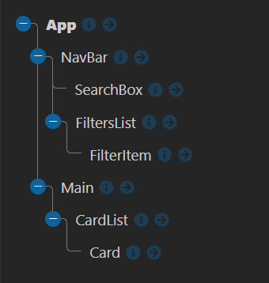

# Feedback

Hey Charlie here, feel free to message me on Slack if you want any clarification on the points below. I will give you both positive and constructive feedback on your project.

---

## Requirements

- Should be built in React - DONE
- Use the Punk API (after using the data file first)
  - DATA - DONE
  - API - DONE
- Test where possible (RTL)
  - Covered later on course so no time to implement, when you have time give it a go.
- Repository on GitHub - DONE

### Start

> "All the wireframe content in black is the first part of the challenge - that is, the sidenav, the main section containing the beers and beer cards for each piece of data. The component tree is below to help you get started."

Below I have the component tree from the brief and your component tree.




Your component tree looks great, you have matched the diagram in the brief. It may seem like overkill but it forces you to use props to get the data to the components that need it. This forces you to use them which will improve your understanding.

When you are building things in React have a go at breaking your project into a component tree before you go in with the code. It will help you manage all of the moving pieces.

It is great you are getting responses from the API. At the moment you are getting 25 back. Have a look at the docs, you can increase this to 80 beers by using query params.

### Extension 1

> Once you've got the design and layout sorted to render the elements, it's time to add some search functionality. Make it so you can search the beers by their name, and the page content should update as you type each letter in the box.

The aim of this extension is to get you using functions as props. You have smashed it, `handleInput()` in your app is being passed multiple component levels to your search component. That component is using the function to capture the user input and storing it in the App state. You then use it to filter your `allBeers` which you then eventually set to your `beer` state. This is interesting!

There is an alternative way of doing the search, this is with query params. On the API docs it has a `beer_name` param which you can append to the url with a value. The value is what you want to search. Why not try and implement the search with this?

```jsx
// App.jsx
const getBeers = async () => {
  let url = "https://api.punkapi.com/v2/beers";
  // IF I HAVE A SEARCH TERM HOW CAN I APPEND THE QUERY PARAM TO THE URL?
  // beer_name= ??

  const response = await fetch(url);
  const data = await response.json();
  setBeers(data);
  setAllBeers(data);
};
```

### Extension 2

> Finally attempt to make it so you can filter the content on three conditions:
>
> - High Alcohol (ABV value greater than 6%)
> - Classic Range (Was first brewed before 2010)
> - High Acidity (pH lower than 4)

You have taken the alternative approach to adding the filters and it does work which is good. You have your `filterCheckboxes` which is very impressive as you have created an array of objects to manage whether your checkboxes have been checked or not. The `handleCheckboxes` function deals with the change correctly. You remove the old checkbox object and replace it with the new one you create in the `<FilterItem/>` component. This amazing!

Your `filterBeers()` being called when the state changes this applies your filters and sets it to state.

I hope you understand how all of this works and feel confident that you could implement it yourself. If you don't remove it and go for a simpler solution.

You can achieve the same result with a boolean state for each filter and a handler function that changes them based on the id. Based on those boolean state toggles you can filter your beers based on that. Understanding is more important, this implementation is good.

React is not opinionated which means you can write it in multiple ways. Personally I think you should simplify your `<FilterItem/>`.

I don't think it should have the logic you currently have in the `toggleCheckbox()` in it.

```jsx
// FilterItem.jsx

const FilterItem = ({ filterName, filterID, handleCheckboxes }) => {
  // REMOVE toggleCheckBox()
  // CHANGE THE ONCLICK TO USE THE FUNCTION YOU PASS INTO IT
  return (
    <div className="filterItem">
      <span>{filterName}</span> <input type="checkbox" id={filterID} onClick={handleCheckboxes}></input>
    </div>
  );
};
```

You can move that logic into `handleCheckboxes()` in the App. You can get access to the event in this function just like you did in the component above. By putting the logic in this function you free up your component. The component only uses a function it gets given it doesn't do anything special it is just a reusable presentational component.

```jsx
// App.jsx

const handleCheckboxes = event => {
  let newFilters = filterCheckboxes.filter(currentFilter => {
    // CHECK THE EVENT.TARGET.ID
    if (currentFilter.id === event.target.id) {
      return false;
    } else {
      return true;
    }
  });
  // CREATE THE NEW OBJECT AND ADD IT TO YOUR FILTERS
  newFilters.push({
    checked: event.target.checked,
    id: event.target.id,
  });
  setFilterCheckboxes(newFilters);
};
```

### Extension 3

> Style the website however you see fit! Go wild!

Completed :)

---

## The App

### Positive

- It looks good on desktop.
- I can see you have started adding media queries as well which is great!
  - They stack at different screen sizes
  - The search sits on top on smaller devices, nice touch!
- You have all of the functionality that was requested.
- It is dynamic and responding to the user interacting with it.

### Constructive

- Get it hosted, you will want to show this project off :)
- Give the project a title / logo / piece of text describing it
- Some of the cards text is quite large, do you think you could only display the first sentence?
  - The description will be a string, what methods can you use on a string to shorten it?
- Update the readme.md with some Markdown & Remove the autogenerated code after the brief. [Markdown in 10mins](https://www.markdowntutorial.com/)

---

## The Code

### Positive

- You have multiple functions being passed across your application to the components that need them.

- The BEM looks good on `<Card/>`

- You are utilizing the power of conditional state to apply your filters.

- You have connected it to an API!!!

- You are demonstrating that you have an understanding of props, useState, useEffect and funcs as props.

- Awesome good going! This is a strong project! I can't wait to see what you build next.

### Constructive

- Try and keep your class names for styling consistent.

  - In the app you are camelCasing `mainGrid` in the `<Card/>` you are using BEM.

- You have the error below in the console. You will know how to fix it.

```
react-jsx-dev-runtime.development.js:98 Warning: Each child in a list should have a unique "key" prop.

Check the render method of `FiltersList`. See https://reactjs.org/link/warning-keys for more information.
    at FilterItem (http://localhost:3000/static/js/bundle.js:493:5)
    at FiltersList (http://localhost:3000/static/js/bundle.js:593:5)
    at div
    at NavBar (http://localhost:3000/static/js/bundle.js:690:5)
    at div
    at App (http://localhost:3000/static/js/bundle.js:37:76)
```

- You are able to organize your project how you like, at the moment your components folder directly matches the component tree. It doesn't have to and if you look at the react-code-along we don't nest the components like this.

  - Personally I don't like nested folders but as I said earlier react is not opinionated so if you like it this way it is okay for personal projects.

- You can implement some of the filters using query params read the docs and see if you can implement them when you have time.

  - `abv_gt=??`, `brewed_before=??`

- You have solved some of the problems with a good and reasonable solutions, they are more advanced then anyone in the group so far. I want you to make sure you understand:
  - **How** the code works.
  - **What** it is doing.
  - **Why** you have written it that way.

---
